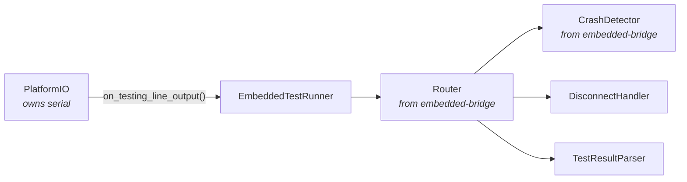
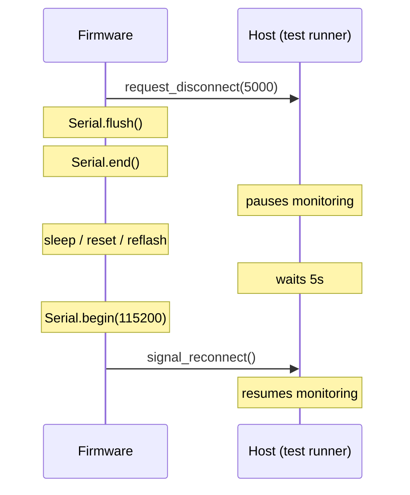
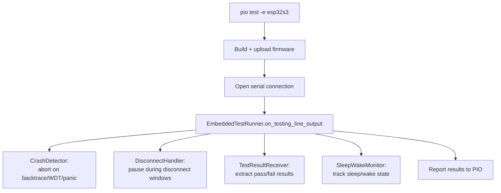

# pio-test-runner — Design

PlatformIO test orchestration for embedded devices. Handles what
`pio test` can't: devices that sleep, reset, disconnect, or crash
during test execution.

## Motivation

PlatformIO's built-in test runner assumes a stable serial connection
from upload through test completion. Real embedded testing breaks this
assumption constantly:

- **Deep sleep** — the device enters deep sleep mid-test; USB-CDC
  disappears; PIO declares the test failed
- **Reset** — a watchdog reset or deliberate reboot loses the serial
  connection; PIO can't recover
- **Long operations** — a GPS fix or cellular connection takes minutes;
  PIO times out
- **Crashes** — a backtrace scrolls past; PIO doesn't distinguish
  "crash" from "test output"

The existing solution is a collection of scripts scattered across
firmware projects: `disconnectable_doctest_runner.py`,
`stop_on_crash.py`, `run_tests.sh`, acceptance test fixtures in
`conftest.py`. These work but are duplicated, tightly coupled to
doctest, and not reusable.

pio-test-runner extracts these patterns into a standalone PlatformIO
plugin that:

1. Works with **any test framework** (doctest, Unity, custom) — it
   orchestrates the device lifecycle, not the assertion format
2. Uses **embedded-bridge receivers** for crash detection and message
   routing — not its own one-off pattern matching
3. Provides **reusable pytest fixtures** for acceptance tests that
   involve device sleep/wake, configuration changes, or multi-step
   sequences

## How It Works with PlatformIO

### PIO's test runner plugin system

PlatformIO allows custom test runners by extending its base runner
class. The runner is registered via a plugin module and selected in
`platformio.ini`:

```ini
[env:esp32s3]
test_framework = custom  ; or doctest, unity — runner wraps any
custom_test_runner = pio_test_runner
```

PIO manages the build/upload cycle and serial connection. It calls the
runner's `on_testing_line_output(line)` for each line of serial output.
The runner processes lines and reports test results back to PIO.

### Where embedded-bridge fits

The test runner does **not** create a `Bridge` instance — PIO owns the
serial connection. Instead, the runner creates **embedded-bridge
receivers** directly and feeds them lines from PIO's callback:



```python
from platformio.test.runners.base import TestRunnerBase
from embedded_bridge.receivers import CrashDetector, Router

class EmbeddedTestRunner(TestRunnerBase):
    NAME = "embedded"

    def __init__(self, *args, **kwargs):
        super().__init__(*args, **kwargs)
        self.crash_detector = CrashDetector()
        self.disconnect_handler = DisconnectHandler()
        self.result_receiver = TestResultReceiver()  # framework-agnostic
        self.router = Router([
            (self.crash_detector, None),          # sees all messages
            (self.disconnect_handler, None),      # sees all messages
            (self.result_receiver, None),          # sees all messages
        ])

    def on_testing_line_output(self, line):
        self.router.feed(line)  # PIO gives us lines; feed directly

        if self.crash_detector.triggered:
            self.report_crash(self.crash_detector.reason)
            return

        if self.disconnect_handler.active:
            return  # suppress output during disconnect

        # Report test results to PIO
        for result in self.result_receiver.drain_results():
            self.report_test_result(result)
```

The rest of the codebase — acceptance test fixtures, standalone scripts
— can use embedded-bridge's full `Bridge` class with transport when they
need to own the connection. The receivers are the same either way.

---

## Core Components

### DisconnectHandler

Manages the disconnect/reconnect protocol between firmware and host.

**Protocol:**



The firmware controls the timing. It tells the host how long it will
be gone, disconnects, does whatever it needs (sleep, reset, reflash
a peripheral), reconnects, and signals readiness.

#### Firmware-side API

pio-test-runner ships a small C++ header that firmware includes. The
wire format is an implementation detail — firmware uses the API, not
raw `Serial.println()`:

```cpp
// pio_test_runner/test_runner.h (shipped with this project)
namespace pio_test_runner {
    /// Tell the host we're going away for `duration_ms` milliseconds.
    /// Call this BEFORE Serial.end() / deep sleep / reset.
    void request_disconnect(uint32_t duration_ms);

    /// Tell the host we're back. Call this AFTER Serial.begin().
    void signal_reconnect();
}
```

The wire format for these messages will be defined as part of the
protocol between the C++ header and the Python `DisconnectHandler`.
Both are maintained in this project so they stay in sync.

Firmware projects include this via `lib_deps` in `platformio.ini`
(or a symlink during early development).

#### Host-side handler

```python
class DisconnectHandler:
    """Receives disconnect/reconnect protocol messages from firmware."""

    def feed(self, message: str) -> None:
        # Intercepts protocol messages from firmware
        ...

    @property
    def active(self) -> bool:
        """True while in a disconnect window — output should be suppressed."""
        ...

    @property
    def disconnect_count(self) -> int:
        """Number of disconnect/reconnect cycles completed."""
        ...
```

**Not just sleep** — the disconnect protocol is general-purpose. The
firmware might:
- Enter deep sleep (USB-CDC disappears)
- Reboot deliberately (testing boot sequences)
- Reconfigure a peripheral that requires serial reinit
- Flash a coprocessor over the same bus

The host doesn't need to know *why* the device disconnected — it just
respects the timing window.

### TestResultReceiver

Receives test results from any framework's output format.

```python
class TestResultReceiver:
    """Framework-agnostic test result extraction."""

    def feed(self, message: str) -> None: ...
    def drain_results(self) -> list[TestResult]: ...
```

**Built-in format support:**

| Framework | Pass pattern | Fail pattern |
|-----------|-------------|-------------|
| doctest | `[doctest] test cases: N \| N passed` | `FAILED:` with assertion details |
| Unity | `:PASS` | `:FAIL:` |
| Custom | Configurable regex patterns | Configurable regex patterns |

The receiver extracts individual test case results (name, pass/fail,
duration, failure message) and normalizes them into a common
`TestResult` structure that PIO can report.

### SleepWakeMonitor (from embedded-bridge)

Sleep/wake detection lives in embedded-bridge (it's a general-purpose
receiver, not test-specific). pio-test-runner uses it to avoid false
timeouts during expected sleep and in acceptance test fixtures to
coordinate multi-step sleep/wake test sequences.

```python
from embedded_bridge.receivers import SleepWakeMonitor

monitor = SleepWakeMonitor(port_path="/dev/ttyACM0")
monitor.state           # "awake", "sleeping", or "waking"
monitor.sleep_duration  # expected duration, if reported by firmware
```

See the embedded-bridge design doc for full details on detection
methods (serial patterns, USB-CDC port disappearance, wake detection).

### Test Filtering

Tests can be filtered at two levels: **compile-time** (baked into the
firmware binary) and **runtime** (sent by the host over serial). Both
are optional and independent — but understanding their interaction is
important, especially for sleep/wake tests.

#### Compile-time filters (`test_runner_config.h`)

A generated header defines macros that `doctest_runner.h` applies via
`context.setOption()` before tests execute:

```c
#pragma once
// Auto-generated — do not commit
#define TEST_FILTER_SUITE "*GPS*"        // doctest -ts=
#define TEST_FILTER_CASE  "*timeout*"    // doctest -tc=
#define TEST_EXCLUDE_SUITE "*slow*"      // doctest -tse=
#define TEST_EXCLUDE_CASE  "*flaky*"     // doctest -tce=
#define TEST_VERBOSE 1                   // enable duration/success output
```

These map directly to doctest's command-line options:

| Macro | doctest option | Effect |
|-------|---------------|--------|
| `TEST_FILTER_SUITE` | `-ts=<value>` | Only run suites matching pattern |
| `TEST_FILTER_CASE` | `-tc=<value>` | Only run cases matching pattern |
| `TEST_EXCLUDE_SUITE` | `-tse=<value>` | Skip suites matching pattern |
| `TEST_EXCLUDE_CASE` | `-tce=<value>` | Skip cases matching pattern |
| `TEST_VERBOSE` | `--success --duration` | Print all assertions |

Patterns use doctest's wildcard syntax: `*` matches any sequence of
characters. Patterns are case-sensitive.

**Lifecycle**: Compile-time filters require a firmware rebuild to change.
Projects typically have a script (e.g. `run_tests.py`) that generates
the header and triggers a rebuild. **Clear the header after use** — a
stale filter silently restricts all future test runs until someone
notices tests are being skipped.

A clean `test_runner_config.h` with no filters:

```c
#pragma once
// Auto-generated — do not commit
// No filter - run all tests
```

#### Runtime filters (`RUN:` command)

After the device boots and sends `PTR:READY`, the host sends one of:

- `RUN_ALL` — no additional filter (use compile-time filters only)
- `RUN: <pattern>` — set doctest's `test-case` filter to `<pattern>`
- `RESUME_AFTER: <test_name>` — skip all tests up to and including
  the named test, then run the rest (see "Running remaining tests
  after sleep" below)

**Important**: The runtime `RUN:` command sets the **test-case** option
(`-tc`), NOT the test-suite option. It does not clear or override any
compile-time filters. Both are additive — a test must match both the
compile-time suite filter AND the runtime case filter to execute.

This means if `TEST_FILTER_SUITE` is set to `"*GPS*"` at compile time,
sending `RUN: *sleep*` at runtime will only run tests that are in a
GPS suite AND have "sleep" in their case name.

#### Filter interaction during sleep/wake

When a test calls `test_deep_sleep()`, the device reboots. On wake:

1. Device runs `run_tests()` from scratch (full boot sequence)
2. `apply_compile_time_filters()` runs again — same filters as before
3. Device sends `PTR:READY`
4. Host sends `RUN: *<sleeping_test_name>*` — targets just the
   sleeping test's Phase 2
5. `apply_runner_command()` sets `test-case` to the sleeping test name
6. The sleeping test detects Phase 2 via `is_test_wake()` (RTC_NOINIT
   marker) and runs its verification logic
7. `PTR:DONE` sent after the test completes

The compile-time suite filter persists across the sleep/wake boundary
(it's compiled into the binary). The runtime filter is re-sent by the
host after wake. No filter state needs to be persisted in RTC memory.

#### Running remaining tests after sleep

When a test enters deep sleep, `context.run()` is interrupted and any
tests registered after the sleep test never execute. The host handles
this automatically:

1. **First cycle**: `RUN_ALL` — runs tests until one sleeps.
2. **Sleep resume**: `RUN: *<sleeping_test>*` — runs Phase 2 only.
3. **Remaining cycle**: `RESUME_AFTER: <sleeping_test>` — the device
   does a listing-only doctest pass to discover test order, builds an
   exclude for all tests up to and including the named test, then runs
   only the remaining tests.
4. **Repeat**: If another test sleeps during step 3, the loop
   continues — resume it, then run another remaining cycle.

The `RESUME_AFTER:` command is handled entirely on the device side.
The device performs a `list-test-cases` dry run to get the ordered
test list, then sets `test-case-exclude` for everything before the
resume point. This avoids the host needing to track test names or
build exclude patterns — it just sends the name of the last test
that completed before the sleep.

#### TestConfigGenerator (planned)

A Python utility to generate `test_runner_config.h`. Currently
specified but not implemented — projects use their own scripts
(e.g. `run_tests.py` in the firmware project).

```python
class TestConfigGenerator:
    """Generate test_runner_config.h for embedded test filtering."""

    def generate(
        self,
        test_case: str | None = None,
        test_suite: str | None = None,
        exclude_case: str | None = None,
        exclude_suite: str | None = None,
    ) -> str:
        """Return header file content with #define filter macros."""
        ...
```

---

## Test Orchestration Flow

### Unit/integration tests (via PIO)



### Acceptance tests (via pytest)

```python
# conftest.py
import pytest
from embedded_bridge import Bridge, SerialTransport
from embedded_bridge.receivers import CrashDetector, SleepWakeMonitor

@pytest.fixture
def device_bridge(request):
    """Provide a Bridge connected to the device under test."""
    bridge = Bridge(
        transport=SerialTransport(device_port(), 115200),
        receivers=[CrashDetector()],
    )
    bridge.connect()
    yield bridge
    bridge.disconnect()

@pytest.fixture
def sleep_monitor(device_bridge):
    """Monitor sleep/wake transitions."""
    monitor = SleepWakeMonitor(
        port_path=device_bridge.transport.port_path,
    )
    device_bridge.add_receiver(monitor)
    return monitor
```

```python
# test_sleep_cycle.py
def test_device_sleeps_and_wakes(device_bridge, sleep_monitor):
    """Verify device completes a sleep/wake cycle."""
    device_bridge.send_command("start_sleep_test")

    # Wait for device to enter sleep
    assert sleep_monitor.wait_for_state("sleeping", timeout=30)

    # Wait for device to wake
    assert sleep_monitor.wait_for_state("awake", timeout=120)

    # Verify device is functional after wake
    response = device_bridge.send_command("status", expect_ack=True)
    assert response.success
```

---

## Relationship to Existing Code

### What moves here from firmware projects

| Existing file | Becomes | Notes |
|---------------|---------|-------|
| `disconnectable_doctest_runner.py` | `EmbeddedTestRunner` | Framework-agnostic, not doctest-specific |
| `stop_on_crash.py` | Uses `embedded_bridge.CrashDetector` | Logic moves to embedded-bridge |
| `run_tests.sh` | `pio-test-runner` CLI or PIO plugin | Shell script becomes proper Python |
| `run_tests.py` (config gen) | `TestConfigGenerator` | |
| `conftest.py` sleep/wake helpers | `SleepWakeMonitor` + fixtures | Reusable across projects |

### What stays in firmware projects

- Test source files (`test_*.cpp`) — these are project-specific
- Acceptance test cases (`test_sleep_cycle.py`) — project-specific
- Project-specific `conftest.py` fixtures (Notehub API, device-specific
  setup) — these import from pio-test-runner but aren't part of it

---

## Project Structure

```
pio-test-runner/
├── pyproject.toml
├── LICENSE
├── README.md
├── docs/
│   └── design.md                      # this file
├── include/
│   └── pio_test_runner/
│       └── test_runner.h              # firmware-side C++ API
├── src/
│   └── pio_test_runner/
│       ├── __init__.py
│       ├── runner.py                  # EmbeddedTestRunner (PIO plugin)
│       ├── disconnect.py             # DisconnectHandler
│       ├── result_receiver.py        # TestResultReceiver (multi-framework)
│       ├── config_generator.py       # TestConfigGenerator
│       └── fixtures/
│           ├── __init__.py
│           ├── bridge.py             # device_bridge fixture
│           ├── sleep.py              # wait_for_sleep / wait_for_wake
│           └── firmware.py           # firmware_builder fixture
└── tests/
    ├── test_disconnect.py
    ├── test_result_receiver.py
    └── test_config_generator.py
```

### Dependencies

```toml
[project]
dependencies = [
    "embedded-bridge",      # receivers (CrashDetector, Router)
    "platformio",           # test runner base class
]

[project.optional-dependencies]
fixtures = [
    "pytest",               # for reusable fixtures
]
```
